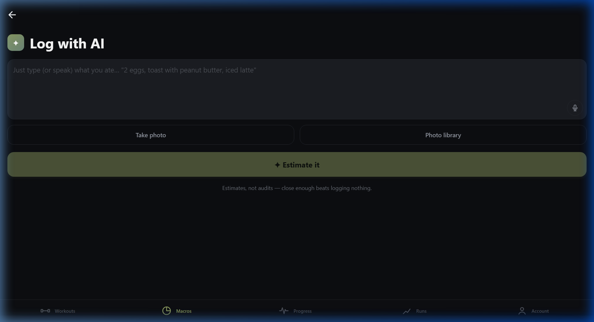

# ⚡ Kinetic Fusion — Fitness & Health Tracker

<div align="center">


**A high-performance, offline-first mobile fitness and health tracking application built with Flutter, Firebase, and a modern design system.**

[Features](#-key-features) • [Screenshots](#-app-screenshots) • [Architecture](#-system-architecture) • [Getting Started](#-getting-started) • [Author](#-author)

</div>

---

## 📱 App Screenshots

<div align="center">
  <table>
    <tr>
      <td align="center" width="33%">
        <b>🔐 Secure Sign-In</b><br/><br/>
        
      </td>
      <td align="center" width="33%">
        <b>📝 Account Registration</b><br/><br/>
        
      </td>
      <td align="center" width="33%">
        <b>🍽️ Macros & Nutrition</b><br/><br/>
        
      </td>
    </tr>
    <tr>
      <td align="center" width="33%">
        <b>🤖 AI Food Logging</b><br/><br/>
        
      </td>
      <td align="center" width="33%">
        <b>👤 Profile & Targets</b><br/><br/>
        
      </td>
      <td align="center" width="33%">
        <b>🏋️ Workout Tracking</b><br/><br/>
        
      </td>
    </tr>
  </table>
</div>

---

## ✨ Key Features

### 🏋️ 1. Train & Workout Tracker
- **Set Logging**: Record exercise sets with weight (**kg**), reps, and completion toggles.
- **Routines & Templates**: Save and load custom workout splits and exercises.
- **1RM Strength Estimation**: Automatic Brzycki 1RM progression formulas.
- **Volume Calculations**: Total accumulated kilograms lifted per workout session.

### 🍽️ 2. Macros & Nutrition
- **Visual Calorie Gauge**: Real-time circular progress indicator tracking remaining daily calories.
- **Macronutrient Split**: Progress bars for Protein, Carbohydrates, and Fats.
- **Meal Organization**: Breakfast, Lunch, Dinner, and Snacks categorization.
- **AI Food Logger**: Natural language meal estimator powered by offline AI heuristic parsing.

### 🏃 3. Runs & Cardio Tracking
- **Outdoor GPS Run**: Real-time route, distance (miles), duration, and pace tracking.
- **Indoor Treadmill Run**: Built-in pedometer step counter sensor tracking.
- **Activity History**: Cumulative mileage and calorie expenditure statistics.

### 📈 4. Progress & Analytics
- **Bodyweight Tracking**: Metric weight log in Kilograms (**kg**).
- **Trend Charts**: Interactive line chart visualizing weight trends over time using `fl_chart`.
- **Strength Analytics**: Monthly lift progression tracking across compound movements.

### 👤 5. Overview & Profile
- **Photo Upload**: Interactive avatar with **Camera capture** and **Phone gallery** photo selection via `image_picker`.
- **Daily Targets**: Customizable calorie targets, weekly workouts, and weight goals.
- **Cloud Sync Status**: Real-time cloud sync indicator.

---

## 🔒 Authentication & Security

- **Hybrid Authentication Engine**: Full Firebase Authentication integration with Cloud Firestore cloud backup.
- **Local Fallback Encryption**: Client-side **SHA-256 cryptographic password hashing** via `crypto` and `flutter_secure_storage`.
- **Session Persistence**: Automatic encrypted token restoration on app launch.
- **Guest Mode**: Offline guest access for immediate offline usability.

---

## 🛠️ System Architecture & Tech Stack

```
flutter_app/
├── lib/
│   ├── models/           # Data models (Exercise, Meal, RunRecord, UserModel, etc.)
│   ├── providers/        # State management (AuthProvider, WorkoutProvider, MacroProvider, etc.)
│   ├── screens/          # UI views (AuthGate, LoginPage, RegisterPage, HomePage, Workouts, etc.)
│   ├── services/         # Firebase, SecureStorage, OfflineStorage, Connectivity, Biometrics
│   ├── theme/            # Kinetic Fusion Color Palette, Typography & Theme Tokens
│   └── widgets/          # Reusable 48px pill buttons, 32px pill inputs, cards
└── android/              # Native Android configuration, permissions & build scripts
```

| Technology | Purpose |
|---|---|
| **Flutter & Dart** | Cross-platform mobile application framework |
| **Provider** | Reactive state management |
| **Firebase Auth & Firestore** | Cloud authentication and database synchronization |
| **Flutter Secure Storage** | Key-value encrypted storage for cryptographic hashes |
| **Shared Preferences** | Local offline storage cache |
| **Image Picker** | Camera and Gallery media access |
| **FL Chart** | Interactive charting and visualization |
| **Connectivity Plus** | Network state and online/offline monitoring |

---

## 🚀 Getting Started

### Prerequisites
- [Flutter SDK](https://docs.flutter.dev/get-started/install) (3.24.0 or newer)
- [Android Studio](https://developer.android.com/studio) / Android SDK
- Java JDK 17+

### Installation & Run

1. **Clone the repository**:
   ```bash
   git clone https://github.com/mohhdmufeed/Fitness-App.git
   cd Fitness-App/flutter_app
   ```

2. **Install dependencies**:
   ```bash
   flutter pub get
   ```

3. **Run on connected device / emulator**:
   ```bash
   flutter run
   ```

4. **Build release APK**:
   ```bash
   flutter build apk --release
   ```

---

## 👨‍💻 Author

<div align="center">

**Mohd Mufeed**

GitHub: [@mohhdmufeed](https://github.com/mohhdmufeed)  
Repository: [mohhdmufeed/Fitness-App](https://github.com/mohhdmufeed/Fitness-App)

</div>

---

## 📄 License

This project is licensed under the MIT License — see the LICENSE file for details.
